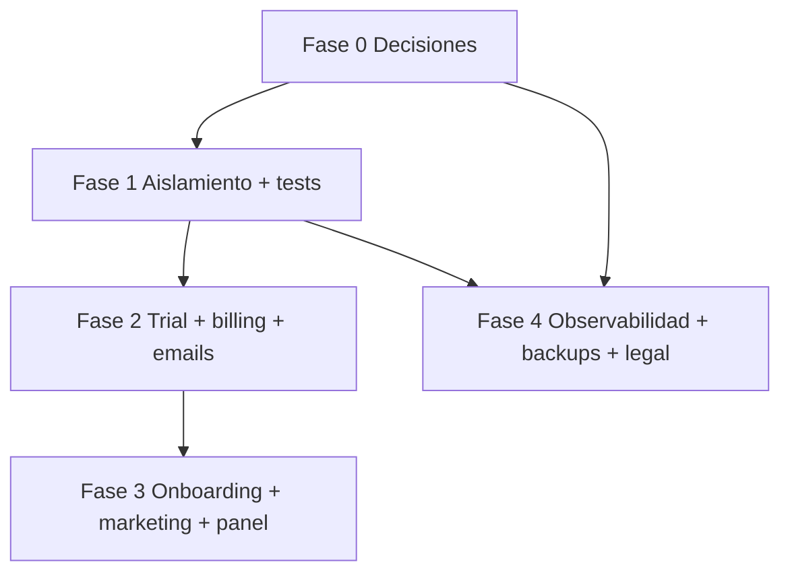

# Plan de implementación — SaaS multi-tenant

Objetivo: llevar el producto a un **modelo comercial SaaS multi-tenant** vendible y operable: captación, facturación del software, aislamiento de datos confiable, operación 24/7 y base legal mínima.

**Audiencia:** equipo de producto e ingeniería.  
**Relación con otros documentos:** estrategia en `docs/PLAN-EVOLUCION-POS-GENERICO.md`, backlog operativo en `docs/PLAN-MEJORAS.md`, técnica multi-tenant en `docs/arquitectura/MULTI-TENANT.md`, billing en `docs/arquitectura/BILLING-SAAS.md`, runbooks en `docs/operacion/`.

**Nota (mantenimiento de `docs/`):** si editas muchos archivos bajo `docs/`, ejecuta desde la raíz del monorepo `npm run verify:docs-links` para validar enlaces internos. No dupliques convenciones o flujo de contribución que ya están en `CONTRIBUTING.md`.

---

## Principios de priorización

1. **Riesgo antes que features:** aislamiento por tenant y pruebas reducen exposición legal y pérdida de confianza.
2. **Monetización antes que pulido:** trial + Stripe enforcement + comunicación de impago sostienen el negocio.
3. **Observabilidad temprana:** sin alertas y runbooks, el SaaS no es “producción” aunque el código funcione.

---

## Fase 0 — Decisiones y línea base (1–2 semanas)

Antes de codificar grandes bloques, fijar:

| Decisión | Opciones típicas | Impacto |
|----------|------------------|---------|
| Registro público | Solo invitación / registro abierto / registro + verificación email | API, emails, fraude |
| Trial | Días fijos, plan `starter` forzado, límites reducidos | `planCode`, `enforce-plan`, UX |
| Dominios | Un solo dominio app vs subdominio por tenant | DNS, cookies, CORS |
| Impago | `BILLING_ENFORCE_PAYMENT` por defecto en prod vs opt-in | Producto y soporte |

**Documento de decisión:** `docs/arquitectura/SAAS-FASE-0-DECISIONES.md`  
**Variables de ejemplo:** `.env.example` (bloque «SaaS Fase 0»).

**Entregables:** documento interno de 1–2 páginas con decisiones + defaults en `.env.example`.

**Criterio de cierre:** equipo alineado; no hay bloqueantes “descubiertos en mitad de sprint”. Completar las filas *Revisión comercial* en `SAAS-FASE-0-DECISIONES.md` y marcar la checklist de su §6 antes de dar por cerrada la fase.

**Estado técnico (2026-05):** implementación alineada a Fase 0 (trial, billing, emails, cron, pantallas legales plantilla, defaults prod en §4.1 de `SAAS-FASE-0-DECISIONES.md`). **Cierre formal de Fase 0** queda supeditado a que comercial rellene fechas/responsables en las filas “Revisión comercial” del mismo documento.

---

## Fase 1 — P0: Confianza multi-tenant (2–4 semanas)

**Rutina de calidad:** en la raíz del monorepo, `npm run verify` debe pasar en verde antes de integrar cambios que afecten aislamiento; mantener al día `docs/arquitectura/TENANT-ISOLATION-INVENTORY.md` según §1.1.

### 1.1 Inventario de aislamiento

- **Inventario vivo:** `docs/arquitectura/TENANT-ISOLATION-INVENTORY.md` (módulos `/api/v1`, patrón y excepciones `plataforma`).
- Mantener: al añadir rutas o queries raw, actualizar esa tabla y la rutina de revisión del mismo doc.

**Criterio de cierre:** lista completa revisada; gaps P0 abiertos como tareas con dueño. Inventario actualizado; tests de aislamiento por módulo crítico en §1.2 y en `docs/ISSUES-SAAS-BACKLOG.md` (Issues 3–4).

### 1.2 Tests de integración por módulo crítico

- Extender `npm run test:integration` con casos **tenant A no lee datos de tenant B** en módulos aún no cubiertos (priorizar: inventario, compras, devoluciones, configuración, empleados, comprobantes según uso).
- Objetivo: cada módulo de negocio con al menos un test de aislamiento o justificación explícita.

**Criterio de cierre:** CI o proceso manual documentado ejecuta la suite sin fallos en entorno con SQL Server + Redis. *En repo:* GitHub Actions job `integration` (`.github/workflows/ci.yml`) corre migraciones, seed y `npm run test:integration` con servicios SQL Server + Redis en **push a `main`** (no en cada PR).

### 1.3 E2E mínimo (frontend)

- **Implementado:** Playwright en `apps/frontend` — `e2e/smoke.spec.ts` (login → `/panel` o `/select-organizacion`). Ver `apps/frontend/e2e/README.md`.
- Variables: `E2E_EMAIL`, `E2E_PASSWORD`; sin ellas el test se omite (útil en CI sin secretos).
- Segundo flujo opcional: POS o lectura de listado tras login.

**Criterio de cierre:** ejecutar localmente o en pipeline con frontend + API + credenciales; job CI global opcional (requiere orquestar servicios).

---

## Fase 2 — P0: Monetización y retención (3–5 semanas)

### 2.1 Trial y estado de suscripción

- Modelo en BD: fechas de trial / flags si no existen (`trialEndsAt` o equivalente documentado).
- Al expirar trial: degradar a plan mínimo o bloquear según política (alineado a Fase 0).
- UI: banners y pantallas coherentes con `GET /saas/context` y `GET /billing/status`.

**Criterio de cierre:** usuario de prueba puede entrar en trial, ver límites, y al vencer el comportamiento es el acordado (no ambiguo).

### 2.2 Cobro y enforcement

- Revisar `billingGuard` + estados Stripe (`billingStatus`) frente a la matriz comercial real.
- Activar `BILLING_ENFORCE_PAYMENT=true` en entornos de staging/prod según decisión.
- Pantalla dedicada “Cuenta suspendida / pago pendiente” con CTA a Portal y soporte.

**Criterio de cierre:** simulación de `past_due` / `canceled` bloquea API según reglas y muestra mensaje claro en frontend.

### 2.3 Emails transaccionales (dunning)

- Completar hooks en `billing.webhook.ts` para eventos relevantes.
- Templates: pago fallido, suscripción cancelada/activada (ya referenciado en `PLAN-MEJORAS` Fase 6).
- Variables SMTP documentadas en `docs/operacion/DEPLOY-SAAS.md`.

**Criterio de cierre:** eventos de prueba en Stripe (test mode) generan email o log auditable si email desactivado.

---

## Fase 3 — P1: Crecimiento (3–6 semanas)

### 3.1 Onboarding self-service (si aplica decisión Fase 0)

- Endpoint seguro: `POST` público o semipúblico para crear tenant + usuario admin (rate limit, CAPTCHA opcional, validación email).
- Alternativa más ligera: formulario “Solicitar demo” que crea lead sin tenant.

**Criterio de cierre:** flujo documentado de punta a punta; sin duplicar `slug` ni dejar tenants huérfanos.

### 3.2 Marketing y planes

- Página pública (landing) alineada a `VISION-PRODUCTO.md` §11.
- Tabla de planes generada desde misma fuente que `plan-limits.ts` **o** proceso de release que valide sincronía (script de verificación en CI).

**Criterio de cierre:** visitante entiende oferta; límites publicados = límites reales.

### 3.3 Panel plataforma (soporte)

- Consolidar `GET /tenants/panel` + UI `/plataforma`: búsqueda, filtros, métricas de uso, estado de billing.
- Reglas de auditoría: quién puede ver qué (solo rol `plataforma`).

**Criterio de cierre:** soporte puede localizar un tenant y ver plan/usage/billing sin acceso a datos innecesarios. *En repo:* `/plataforma` con búsqueda y filtros en cliente; auditoría de acciones tipo “impersonar” no incluida (backlog Issue 11).

---

## Fase 4 — P1: Operación y cumplimiento (paralelo a Fase 3)

### 4.1 Observabilidad

- Métricas: tasa de error por ruta, latencia p95, fallos de webhook Stripe.
- Logs estructurados con `X-Request-Id` ya presente; enlazar en runbook de incidentes.

**Criterio de cierre:** dashboard mínimo (aunque sea externo) + alertas en 2–3 condiciones críticas.

### 4.2 Backups y recuperación

- Runbook: restore drill trimestral (o según política).
- Verificar `docs/operacion/BACKUP-SQL-SERVER.md` vs entorno real.

**Criterio de cierre:** evidencia de un restore exitoso en staging (fecha + responsable).

### 4.3 Legal mínimo

- Páginas: Términos, Privacidad, contacto DPO/soporte.
- Claridad: datos del cliente final del negocio vs datos del suscriptor del software.

**Criterio de cierre:** enlaces visibles en login/landing; revisión jurídica externa recomendada antes de escala.

---

## Fase 5 — P2: Diferenciación y escala (continuo)

- Integraciones (contabilidad, e-commerce) según ICP.
- Offline/PWA solo si hay demanda validada.
- Escalado SQL: índices, particiones, read replicas según volumen.
- “Marca blanca” avanzada (dominio por tenant) si entra en roadmap comercial.

---

## Matriz de dependencias (resumen)

---

## Cómo ejecutar este plan

1. Usar **`docs/ISSUES-SAAS-BACKLOG.md`** como plantilla de issues (15 ítems con título y cuerpo listos para GitHub), o convertir cada **subsección** de este documento en issues con estimación (S/M/L).
2. Revisión quincenal: mover items entre P0/P1 según riesgo y feedback de clientes piloto.
3. Tras cada fase mayor: actualizar `docs/PLAN-MEJORAS.md` y el estado en `VISION-PRODUCTO.md` si cambia el alcance.

---

## Checklist rápido “¿listo para vender SaaS multi-tenant?”

- [x] Aislamiento revisado y tests de integración por módulo crítico (inventario + suites `*-tenant-isolation`; ampliar solo si hay nuevos módulos).
- [x] E2E mínimo (Playwright local + workflow manual `e2e-manual.yml` + `docs/operacion/E2E-STAGING.md`; E2E en cada PR sigue opcional).
- [x] Trial + política de fin de trial **implementada** (`trialEndsAt`, banners, 402 opt-in, cron); **definición comercial** final en `SAAS-FASE-0-DECISIONES.md` (filas revisión).
- [ ] Stripe **live** configurado; webhooks OK; evidencia en `docs/operacion/evidence/STRIPE-VALIDATION-LOG.md` (test/staging puede estar validado).
- [x] Emails o alternativa auditada para eventos de billing (templates + `stripe_audit_logs`).
- [x] Observabilidad **en repo** (runbook `docs/operacion/OBSERVABILITY-RUNBOOK.md` §7 “ante una alerta”, prácticas como `X-Request-Id`, enlace desde `docs/operacion/DEPLOY-SAAS.md` §8).
- [ ] **Pendiente por entorno (ops):** proveedor de logs/APM conectado y 2–3 **alertas reales** en producción (ver `PLAN-CIERRE-PROYECTO.md` WS5; sin evidencia en git).
- [ ] Backup + restore probado (plantilla `docs/operacion/evidence/BACKUP-RESTORE-DRILL-LOG.md` + drill real).
- [x] Legal mínimo publicado (rutas `/terminos`, `/privacidad`); **revisión jurídica** pendiente antes de escala.
- [x] Landing/planes alineados a `plan-limits.ts` (`npm run verify:landing-plans` en CI).

*Documento vivo: ajustar plazos según tamaño del equipo y prioridad comercial.*
